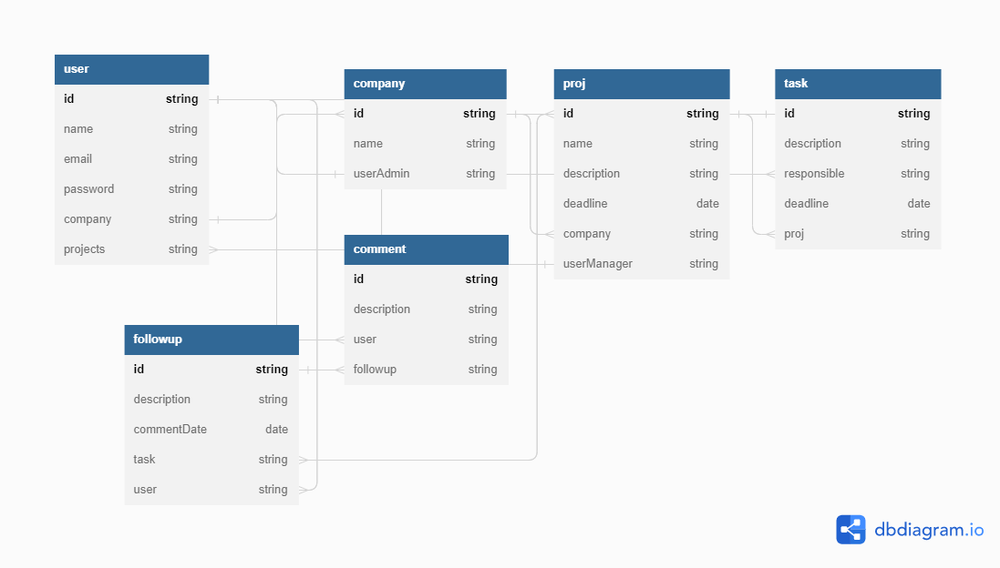

# Agile Documentation

Documentation generated with some agile definitons to help in project planning.

## Actors

- Potentially new user
- New User
- User
- Company Admin
- Company Employee
- Project Manager
- Project Employee

## User Stories

- PNU1 -As a Potentially New User, I want to registrate into the system;
- NU1 - As a New User, I want to login into the system;
- U1 - As an User, I want to have the possibility to update my data (including password, excluding email);
- U2 - As an User, I want to find other Users by name;
- U3 - As an User, I want to delete my own account (and have my associated Company and Projects to be deleted too);
- U4 - As an User, I want to create a Company, passing it's name;
- U5 - As an User, I want to find Companies by name;
- U6 - As an User, I want to see who are the Company Admin;
- CA1 - As a Company Admin, I want to have the possibility to update my Company data;
- CA2 - As a Company Admin, I want to include another users that don't have Company to ingress to my Company;
- CA3 - As a Company Admin, I want to fire users from my Company;
- CA3 - As a Company Admin, I want to have the possibility to delete my Company;
- CA4 - As a Company Admin, I want to create a new Project on the Company, assigning a Project Manager on it;
- CE1 - As a Company Employee, I want to see the actual Projects on the Company;
- PM1 - As a Project Manager, I want to update data about the project;
- PM2 - As a Project Manager, I want to add specific tasks and assign a deadline for them;
- PM3 - As a Project Manager, I want to include Company Employees to the project;
- PM4 - As a Project Manager, I want to assign a Task to a Project Employee;
- PM5 - As a Project Manager, I want to add comments to Follow Ups in Tasks;
- PM6 - As a Project Manager, I want to edit tasks;
- PM7 - As a Project Manager, I want to delete tasks;
- PE1 - As a Project Employee, I want to see all the tasks for a Project;
- PE2 - As a Project Employee, I want to see only my tasks in a Project;
- PE3 - As a Project Employee, I want to add follow-ups to my tasks;
- PE4 - As a Project Employee, I want to check a task as completed;

## Domains and Modelling

